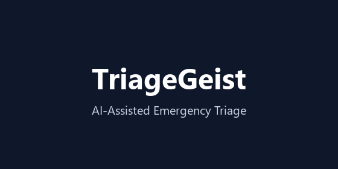

# TriageGeist: From Shortcut Detection to Clinically Honest ESI Prediction



[](https://kaggle.com/competitions/triagegeist)
[](https://www.python.org/)
[](#data--license)

A multi-modal pipeline for **Emergency Severity Index (ESI)** triage acuity prediction, built for the **Triagegeist: AI in Emergency Triage** competition (Laitinen-Fredriksson Foundation, 2026).

**Central contribution:** a shortcut audit proving this dataset's chief-complaint text has a near-deterministic mapping to the label — a leakage-prone validation split will report an inflated, clinically meaningless QWK. We quantify the gap and report the honest, leakage-aware benchmark instead.

> Full methodology, results, and limitations are in the [Kaggle Writeup](https://kaggle.com/competitions/triagegeist/writeups/new-writeup-1782033521773).

---

## Pipeline Overview

| # | Section |
|---|---------|
| 1 | Setup — auto-installs full toolchain |
| 2 | Data loading & integrity checks |
| 3 | EDA — clinical visualisations |
| 4 | **Shortcut audit** — StratifiedKFold vs GroupKFold QWK comparison |
| 5 | Feature engineering — 28 clinical features (qSOFA, SIRS, MEWS, safety flags, keyword tiers, missingness encoding) |
| 6 | Semantic NLP — sentence-transformers + UMAP |
| 7 | 4-model GPU stacked ensemble (XGBoost, LightGBM, CatBoost + tabular-only honest benchmark) + Optuna HPO |
| 8 | Threshold optimisation (differential evolution) |
| 9 | Conformal prediction (uncertainty sets) |
| 10 | Explainability — SHAP, LIME, SHAP-based counterfactual analysis |
| 11 | Ablation study |
| 12 | Survival analysis (Kaplan-Meier, CoxPH) |
| 13 | Bias & fairness audit |
| 14 | Responsible AI — safety layer + model card |
| 15 | Final submission + saved artifacts |
| 16 | Limitations & references |

---

## How to Run

This notebook is designed to run on **Kaggle** using the Kaggle-hosted dataset and a Kaggle GPU runtime. All dependencies are installed automatically inside the notebook — no local environment setup is needed.

### Step 1 — Import the notebook on Kaggle

1. Go to [kaggle.com](https://www.kaggle.com) and sign in.
2. Navigate to **Code → New Notebook**.
3. Click **File → Import Notebook** and upload `triagegeist.ipynb` from this repository.

### Step 2 — Attach the dataset

The notebook expects the public **Triagegeist dataset** as a Kaggle input:

1. In the notebook editor, click **+ Add Input** (right sidebar).
2. Search for **`dgp015/triagegeist-dataset`** and add it.
3. The data will be available at:

   ```
   /kaggle/input/datasets/dgp015/triagegeist-dataset/
   ```

   The notebook auto-detects this path (and several fallback paths) in the data-loading cell — **no manual path editing needed**.

### Step 3 — Set the runtime and run

1. In **Notebook Settings → Accelerator**, select **GPU T4 × 2**.  
   *(CPU-only will work but will be significantly slower for the sentence-transformer embedding and GPU-boosted models.)*
2. Click **Run → Run All**.
3. Expected runtime: **~35–45 minutes** end-to-end on a Kaggle GPU T4 × 2 session.

---

## Outputs

On a successful run, all artifacts are written to `/kaggle/working/` and visible in the notebook's **Output** tab:

| File | Description |
|------|-------------|
| `submission.csv` | Final ESI predictions for the test set |
| `oof_predictions.csv` | Out-of-fold predictions with per-class probabilities |
| `triage_rules.txt` | Extracted decision-tree rules, safety flag thresholds, top SHAP features |
| `meta_model.pkl` | Trained stacked meta-model |
| `nlp_pca.pkl` | Fitted NLP + PCA transformer |
| `optimal_thresholds.npy` | Calibrated classification thresholds |
| `lr_nlp_classifier.pkl` | Logistic regression NLP classifier |
| `*.png` | EDA, shortcut audit, model comparison, SHAP/LIME plots, bias/equity heatmaps, survival curves, bedside decision tree |

---

## Reproducibility

| Setting | Value |
|---------|-------|
| Random seed | `2025` (fixed across all splits, models, bootstrap resampling, and UMAP) |
| Environment | Kaggle GPU T4 × 2, Python 3.12 |
| Dependency management | All packages auto-installed via `pip` in Section 1 — no manual setup |
| Execution | Top-to-bottom, no manual intervention required |

---

## Data & License

**Dataset:** Triagegeist synthetic dataset (Laitinen-Fredriksson Foundation, 2026), publicly available on Kaggle at [`dgp015/triagegeist-dataset`](https://www.kaggle.com/datasets/dgp015/triagegeist-dataset).

- Fully synthetic, calibrated to MIMIC-IV-ED and NHAMCS distributions.
- Used under the competition's **Non-Commercial Research License — competition use only**.

**Cite as:**  
> Laitinen-Fredriksson Foundation (2026). *Triagegeist Dataset.* https://kaggle.com/competitions/triagegeist

---

## Limitations

This is a **decision-support research prototype** — not validated for clinical deployment. Key limitations:

- **Synthetic-data shortcut:** chief-complaint text has near-deterministic label mapping; honest benchmark uses GroupKFold to prevent leakage.
- **Single-source calibration:** synthetic data calibrated to MIMIC-IV-ED and NHAMCS; may not generalise to other ED systems or countries.
- **Label noise:** ESI labels in the synthetic dataset may not perfectly reflect real clinician decisions.
- **Language bias:** NLP components trained on English-language chief complaints only.

See the full [Kaggle Writeup](https://kaggle.com/competitions/triagegeist/writeups/new-writeup-1782033521773) for an extended discussion.

---

## Repository Structure

```
TriageGeist/
├── triagegeist.ipynb   # Main notebook — full pipeline
├── README.md           # This file
├── .gitignore          # Ignores outputs, checkpoints, and secrets
└── LICENSE             # Non-Commercial Research License (see Data section)
```
